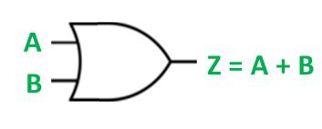
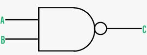
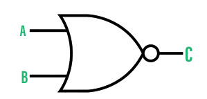
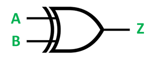
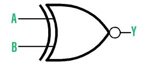

# BASIC LOGIC GATES

## AND GATE

 **def :** The logic gate that takes 2 or more input and only returns true if every input is true.

 **boolean expression :** <kbd>F = A.B </kbd>

 **TRUTH TABLE** :
 A | B | F = A. B |
 -|-|-
 0|0|0
 0|1|0
 1|0|0
 1|1|1

 **logic circuit** :

## OR GATE

**def :** The logic gate that takes 2 or more input and returns true if either 1 of every input is true.

 **boolean expression :** <kbd>F = A + B </kbd>

 **TRUTH TABLE** :
 A | B | F = A. B |
 -|-|-
 0|0|0
 0|1|1
 1|0|1
 1|1|1

 **logic circuit** :

## NOT GATE

**def :** The logic gate that takes only 1 input and returns the logical complement of it.

 **boolean expression :** <kbd>F = A' </kbd>

 **TRUTH TABLE** :
 A |F = A'|
 -|-
 0|1
 1|0

 **logic circuit** :

## NAND GATE

 **def :** The logic gate that takes 2 or more input and returns the complement of the dot multiplication of every input. It's function is the logical complement of the AND GATE.

 **boolean expression :** <kbd>F = (A. B)'</kbd>

 **TRUTH TABLE** :
 A | B |F = (A. B)'|
 -|-|-
 0|0|1
 0|1|1
 1|0|1
 1|1|0

 **logic circuit** :

## NOR GATE

 **def :** The logic gate that takes 2 or more input and returns the complement of the addition of every input. It's function is the logical complement of the OR GATE.

 **boolean expression :** <kbd>F = (A + B)'</kbd>

 **TRUTH TABLE** :
 A | B |F = (A + B)'|
 -|-|-
 0|0|1
 0|1|0
 1|0|0
 1|1|0

 **logic circuit** :

## XOR GATE

 **def :** The logic gate that takes 2 or more input and returns true if the number of true inputs is odd.

 **boolean expression :** <kbd>F = A.B' + A'.B </kbd>

 **TRUTH TABLE** :
 A | B | F = A.B' + A'.B |
 -|-|-
 0|0|0
 0|1|1
 1|0|1
 1|1|0

 **logic circuit** :

## XNOR GATE

 **def :** The logic gate that takes 2 or more input and returns true if the number of true inputs is even or zero. It's function is the logical complement of the XOR GATE.

 **boolean expression :** <kbd> F = A.B + A'.B'</kbd>

 **TRUTH TABLE** :
 A | B |F = A.B + A'.B'|
 -|-|-
 0|0|1
 0|1|0
 1|0|0
 1|1|0

 **logic circuit** :

